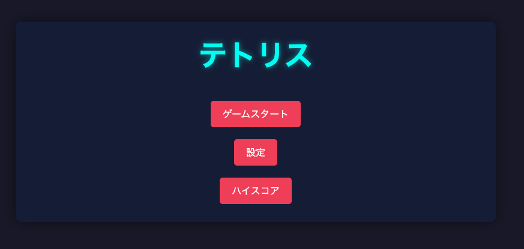

# テトリス

## 感想
- ハイスコア記録機能とホールド機能はないけどテトリスとしては遊べる
- 要件：geminiで生成
- モデル：claude-3.7-sonnet

このプロジェクトは、クラシックなパズルゲーム「テトリス」のWebアプリケーション実装です。HTML5 Canvas APIを使用して開発されており、モダンなUI/UXを備えています。



## 特徴

- 7種類のテトリミノ（I, O, T, S, Z, J, L）
- ゴーストピース表示
- ホールド機能
- 次のテトリミノ表示
- レベルシステム（レベルに応じた落下速度の調整）
- スコアシステム
- ハイスコアの保存
- 操作設定
- 難易度設定
- サウンドエフェクト

## プレイ方法

### 操作方法

- **左矢印キー**: テトリミノを左に移動
- **右矢印キー**: テトリミノを右に移動
- **下矢印キー**: ソフトドロップ（一時的に落下速度を上げる）
- **スペースキー**: ハードドロップ（テトリミノを即座に最下部まで落下させる）
- **X キー**: テトリミノを時計回りに回転
- **Z キー**: テトリミノを反時計回りに回転
- **C キー**: テトリミノをホールド
- **ESC キー**: ポーズ/再開

### ゲームのルール

1. テトリミノを操作して、水平な列を完成させましょう。
2. 行が埋まると、その行は消え、上の行が下に落ちてきます。
3. 一度に複数の行を消すと、より多くのポイントが獲得できます。
4. 画面上部までブロックが積み上がるとゲームオーバーです。

## 開発情報

### 技術スタック

- HTML5
- CSS3
- JavaScript (ES6+)
- Canvas API

### プロジェクト構造

```
/
├── index.html     # メインHTMLファイル
├── styles.css     # スタイルシート
├── js/            # JavaScriptファイル
│   ├── tetromino.js  # テトリミノの定義
│   ├── game.js       # ゲームロジック
│   ├── ui.js         # UI管理
│   └── main.js       # メインスクリプト
└── README.md      # このファイル
```

## ローカルでの実行方法

1. このリポジトリをクローンまたはダウンロードします。
2. Webサーバーを起動します（例: Visual Studio Codeの「Live Server」拡張機能を使用）。
3. ブラウザで`index.html`を開きます。

## 将来の拡張計画

- マルチプレイヤーモード
- タイムアタックモード
- カスタムテーマ

## 謝辞

- テトリスの原作者 Alexey Pajitnov 氏に敬意を表します。
- このプロジェクトは学習および教育目的で作成されました。 
